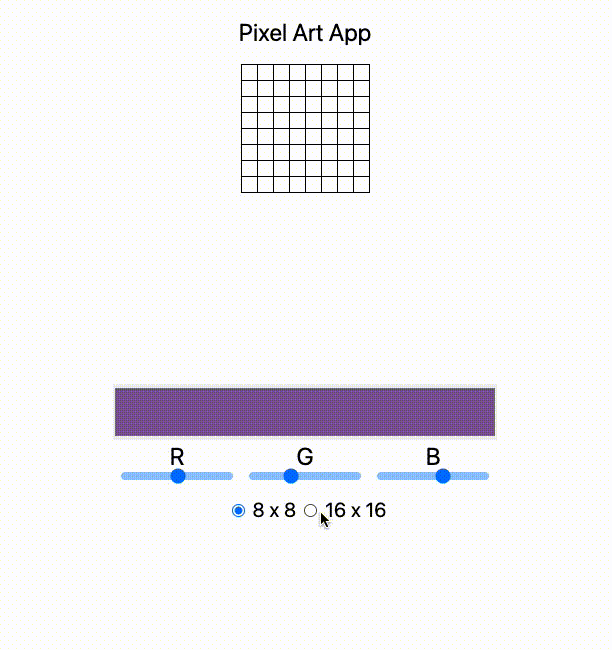

#　 typescript-react-pixel-art

ドット絵



## Run

```
npm start
```

## Testing

```
npm test
```

## Install Memo

```
npx create-react-app --template typescript .
```

### tailwind

[](https://tailwindcss.com/docs/installation)

### Testing

カスタム hooks のテスト用

```
npm install --save-dev @testing-library/react-hooks
```
